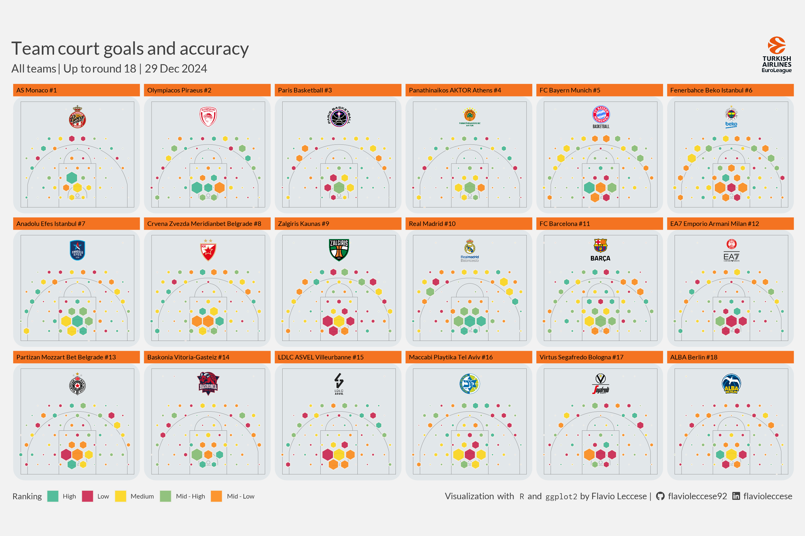

<!-- README.md is generated from README.Rmd. Please edit that file -->

# euroleaguer 

<!-- badges: start -->

[](https://CRAN.R-project.org/package=euroleaguer)
[](https://github.com/FlavioLeccese92/euroleaguer/actions/workflows/R-CMD-check.yaml)
[](https://lifecycle.r-lib.org/articles/stages.html#experimental)


<!-- badges: end -->

**euroleaguer** provides an easy way to retrieve data from
[Euroleague](https://www.euroleaguebasketball.net/euroleague/) and
[Eurocup](https://www.euroleaguebasketball.net/eurocup/) API with R.


This is an unofficial API wrapper and we recommend to follow usual rules
of conduct when dealing with open API calls.

## Installation

To get the current released version from CRAN:

``` r
install.packages("euroleaguer")
```

To get the current development version from
[GitHub](https://github.com/):

``` r
# install.packages("devtools")
devtools::install_github("FlavioLeccese92/euroleaguer")
```

## Why an R package?

Despite Euroleague official APIs are very well designed and immediate, a
more intense analytical use demands a few adjustments in terms of
get-requests and output.

With `euroleaguer` it is possible to input multiple arguments at once
(handling for loops internally), values are returned as tibbles and
columns are consistent throughout all the functions, avoiding ambiguity
of stats naming such as `2FG%` (2 field-goal %) for `2P%` (2 points %).
In short, saving time on collection and cleaning and leaving more for
pure analysis.

## What can be done

This package allows to retrieve a wide variety of **real-time** and
historical data by different types of aggregation, particularly by
player, team or game.

Standard statistics are available as well as some advanced such as
`AST/TO` (ratio of assists made to turnovers committed) or `AST-R`
(estimated % of assists per player’s offensive possessions) and many
more. Complete list can be found
[here](https://flavioleccese92.github.io/euroleaguer/articles/glossary.html).

An additional and insightful information is the coordinates of shots in
games which can be retrieved by `getGamePoints`.

If you are interested in data visualization, some useful resources can
be found in *articles*, which create the following plots:



