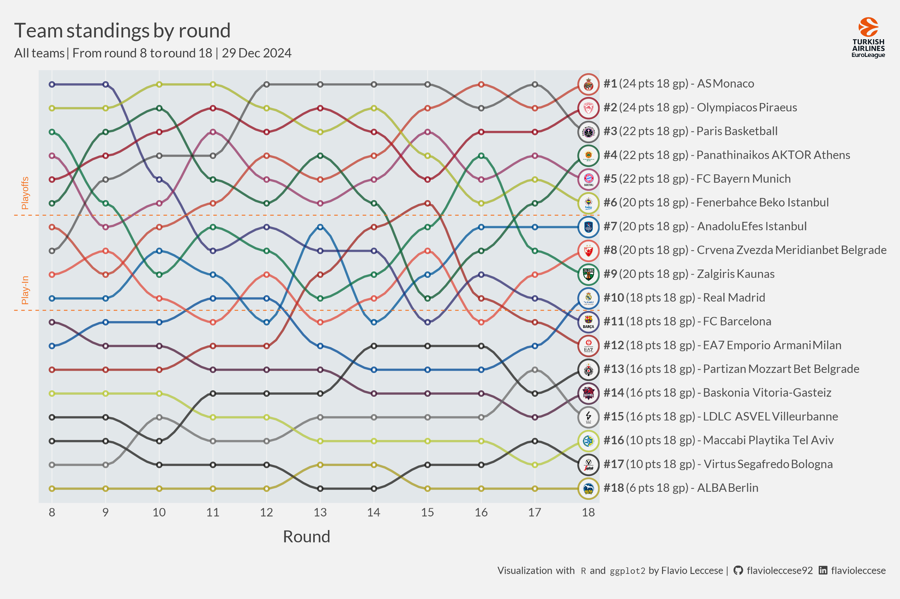

```{r markdown-set, include=FALSE}
knitr::opts_chunk$set(
  echo = TRUE,
  message = FALSE,
  warning = FALSE
)
invisible(Sys.setlocale(locale = "en_EN.UTF-8"))

library(devtools)
install_github("teunbrand/elementalist")
install_github("flavioleccese92/euroleaguer")
```

## Goal

We want to create a chart for each team showing the field-goals percentage and
overall attempts on the court.

Colours are ranging from
<span style="font-family:'Source Code Pro';background-color:#C70D3A;color:white;">#C70D3A</span>
  (lower percentages) to
<span style="font-family:'Source Code Pro';background-color:#2EB086;color:white;">#2EB086</span>)
  (high percentages)
and size of hexagons <span style="color:#F47321; font-size:20px;">&#x2B22;</span>
  are corresponding to the number of attempts.

Data can be obtained through `getGamePoints` function.

Resulted plot can be found at the bottom of this page.

## Setup

```{r setup}
library(euroleaguer)
library(tidyr)
library(dplyr)
library(ggplot2)
library(ggtext)
library(showtext)
library(ggimage)
library(glue)
library(geomtextpath)
library(hexbin)
library(elementalist)

# Add Lato font (Euroleague official font)
font_add_google("Lato", "Lato")
font_add_google("Inconsolata", "Inconsolata")

# Add Font Awesome for logos
font_add(family = "Font Awesome 6 Brands",
         regular = "figures/fa-brands-400.ttf")
showtext_opts(dpi = 200)
showtext_auto()
```

## Data

```{r data}
CompetitionRounds = getCompetitionRounds("E2023") %>%
  filter(MinGameStartDate <= Sys.Date())

CompetitionStandings = getCompetitionStandings("E2023", CompetitionRounds$Round)

MaxRound = max(CompetitionRounds$Round)
MaxGameDate = max(CompetitionRounds$MaxGameStartDate)
NRounds = 12

Teams = getTeam("E2023", unique(CompetitionStandings$TeamCode))
```

## Data for plot

```{r data for plot}
CompetitionStandings = 
  CompetitionStandings %>%
  left_join(Teams %>% select(TeamCode, PrimaryColor, SecondaryColor),
            by = "TeamCode") %>%
  left_join(CompetitionStandings %>% filter(Round == MaxRound) %>%
              arrange(desc(Position)) %>%
              mutate(y = factor(glue("**#{Position}** ({GamesWon*2} pts) - {TeamName}"),
                                levels = glue("**#{Position}** ({GamesWon*2} pts) - {TeamName}"))) %>%
              select(y, Position),
            by = "Position") %>%
  filter(Round %in% (MaxRound - NRounds):MaxRound) %>% 
  mutate(x = Round)

LastRound = CompetitionStandings %>% filter(Round == MaxRound)
PreviousRounds = CompetitionStandings %>% filter(Round < MaxRound)
```

## Image for plot

```{r images for plot}
TeamImage = CompetitionStandings %>%
  slice_max(order_by = Round) %>%
  filter(!is.na(TeamImagesCrest)) %>%
  distinct(x, y, TeamName, TeamImagesCrest)
```

## Title, subtitle and caption

```{r title, subtitle and caption}
PlotTitle = glue(
  "<span style = 'font-size: 32px'>Team standings by round</span><br>
  <span style = 'font-size: 20px'>All teams | From round {MaxRound - NRounds} to round {MaxRound} |
  {MaxGameDate}</span>")

PlotSubtitle = glue(
  "<span></span>")

PlotCaption = glue(
  "<span>Visualization with </span>
  <span style = 'font-family:\"Inconsolata\";'>R</span>
  <span>and</span>
  <span style = 'font-family:\"Inconsolata\";'>ggplot2</span>
  <span>by Flavio Leccese |</span>
  <span style = 'font-family:\"Font Awesome 6 Brands\";'>&#xf09b;</span>
  <span>flavioleccese92</span>
  <span style = 'font-family:\"Font Awesome 6 Brands\";'>&#xf08c;</span>
  <span>flavioleccese</span>")
```

## Plot

```{r plot}
# Initialize
e = CompetitionStandings %>%
  ggplot(aes(x = x, y = y))

# Add vertical lines
e = e +
  geom_vline(data = PreviousRounds, aes(xintercept = x), colour =  "#f2f2f2")

# Add standing lines by team
e = e +
  geom_line(stat = "smooth", method = "loess", formula = 'y ~ x',
            aes(colour = SecondaryColor, group = TeamName), 
            alpha = 0.50, linewidth = 1.25, se = FALSE, span = 0.25) +
  geom_line(stat = "smooth", method = "loess", formula = 'y ~ x',
            aes(colour = PrimaryColor, group = TeamName), 
            alpha = 0.50, linewidth = 1.25, se = FALSE, span = 0.25)

# Add points by round and team
e = e +
  geom_point(data = PreviousRounds, aes(colour = SecondaryColor), alpha = 0.50, size = 3) +
  geom_point(data = PreviousRounds, aes(colour = PrimaryColor), alpha = 0.50, size = 3) +
  geom_point(data = PreviousRounds, colour = "#f2f2f2", size = 1) +
  geom_point(data = LastRound, aes(colour = SecondaryColor), alpha = 0.50, size = 12) +
  geom_point(data = LastRound, aes(colour = PrimaryColor), alpha = 0.50, size = 12) +
  geom_point(data = LastRound, colour = "#f2f2f2", size = 10)

# Add images + general theme setting
e = e +
  geom_image(data = TeamImage, aes(y = y, image = TeamImagesCrest), size = 0.03,
             image_fun = function(img) { magick::image_crop(img) }) +
  scale_colour_identity() +
  scale_y_discrete(position = "right") +
  scale_x_continuous(breaks = 1:MaxRound, labels = 1:MaxRound,
                     expand = c(0.01, 0.1)) +
  theme(
    # General
    panel.grid.major = element_blank(),
    panel.grid.minor = element_blank(),
    panel.background = element_rect(fill = "#e2e7ea"),
    plot.background = element_rect(fill = "#f2f2f2", colour = "transparent"),
    plot.margin = margin(32, 15, 40, 17),
    text = element_text(color = "#404040", family = "Lato"),
    # Axis labels
    axis.ticks = element_blank(),
    axis.title.y = element_blank(),
    axis.title.x = element_text(size = 20, vjust = -2.5),
    axis.text.y.right = element_markdown(size = 14),
    axis.text.x = element_text(size = 14, vjust = 0.5),
    # Legend
    legend.background = element_blank(),
    legend.box.background = element_blank(),
    legend.key = element_blank(),
    legend.position = 'bottom',
    legend.justification = 'left',
    legend.direction = 'horizontal',
    legend.margin = margin(10, 0, 15, 0),
    legend.box.spacing = unit(0, "pt"),
    # Title, subtitle, caption
    plot.title = element_markdown(lineheight = 1, size = 24, hjust = 0, 
                                  vjust = 1, margin = margin(0, 0, -20, 0)),
    plot.title.position = "plot",
    plot.subtitle = element_markdown(hjust = 1, margin = margin(-30, 3, 0, 0)),
    plot.caption = element_markdown(size = 12, margin = margin(40, 0, 0, 3)),
    plot.caption.position = "plot",
    # Facet
    strip.background = element_rect(fill = "#F47321"),
    strip.text = element_text(colour = "black", hjust = 0)
  ) +
  labs(title = PlotTitle, subtitle = PlotSubtitle, caption = PlotCaption,
       x = "Round", y = "")
```


```{r save, include=FALSE}
# Save plot (standard width 4100)
ggsave("team-standings-race.png", plot = e, path = "../../man/figures/",
       height = 2000, width = 4100, units = "px", dpi = 200)

```

## Result


