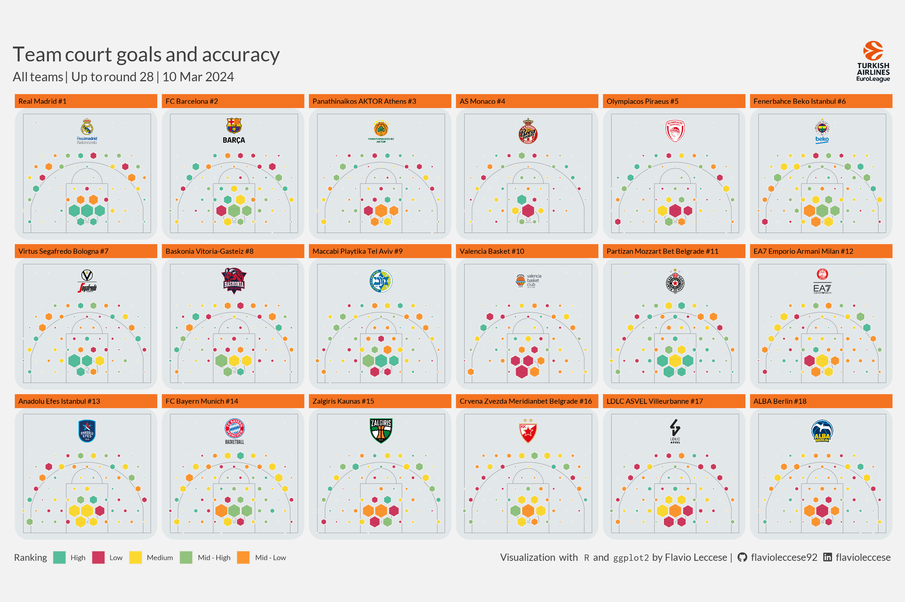

```{r markdown-set, include=FALSE}
knitr::opts_chunk$set(
	echo = TRUE,
	message = FALSE,
	warning = FALSE
)
invisible(Sys.setlocale(locale = "en_EN.UTF-8"))

library(devtools)
install_github("teunbrand/elementalist")
install_github("flavioleccese92/euroleaguer")
```

## Goal

We want to create a chart for each team showing the field-goals percentage and
overall attempts on the court.

Colours are ranging from
<span style="font-family:'Source Code Pro';background-color:#C70D3A;color:white;">#C70D3A</span> 
(lower percentages) to 
<span style="font-family:'Source Code Pro';background-color:#2EB086;color:white;">#2EB086</span>)
(high percentages)
and size of hexagons <span style="color:#F47321; font-size:20px;">&#x2B22;</span> 
are corresponding to the number of attempts.

Data can be obtained through `getGamePoints` function.

Resulted plot can be found at the bottom of this page.

## Setup

```{r setup}
library(euroleaguer)
library(tidyr)
library(dplyr)
library(ggplot2)
library(ggtext)
library(showtext)
library(ggimage)
library(glue)
library(geomtextpath)
library(hexbin)
library(elementalist)

# Add Lato font (Euroleague official font)
font_add_google("Lato", "Lato")
font_add_google("Inconsolata", "Inconsolata")

# Add Font Awesome for logos
font_add(family = "Font Awesome 6 Brands", 
         regular = "figures/fa-brands-400.ttf")
showtext_opts(dpi = 200)
showtext_auto()
```

## Data

```{r data}
CompetitionRounds = getCompetitionRounds("E2023") %>%
  filter(MinGameStartDate <= Sys.Date())

MaxRound = max(CompetitionRounds$Round)
MaxGameDate = format(as.Date(max(CompetitionRounds$MaxGameStartDate)), 
                     '%d %b %Y')

CompetitionStandings = getCompetitionStandings("E2023", MaxRound)
CompetitionGames = getCompetitionGames("E2023", CompetitionRounds$Round)
GamePoints = getGamePoints("E2023", CompetitionGames$GameCode)
```

## Court

```{r court}
source("scripts/construct-court.R")
Court = ConstructCourt()

# Define parameters for fitting coords into Court
DistX = 1.5; DistY = DistX*sqrt(3)/2
CourtMinX = min(Court$x); CourtMaxX = max(Court$x)
CourtMinY = min(Court$y); CourtMaxY = max(Court$y)
nx = ceiling((CourtMaxX - CourtMinX)/DistX)
ny = ceiling((CourtMaxY - CourtMinY)/DistY)
Origin = c(CourtMinX, CourtMinY)
```

## Hexgrid

```{r hexgrid}
HexGrid = tibble(
  Hex_ID = 1:(nx*ny),
  x = sort(c(rep(seq(from = 0, by = DistX, length.out = nx),
                 each = ceiling(ny/2)),
             rep(seq(from = DistX/2, by = DistX, length.out = nx),
                 each = floor(ny/2)))) + Origin[1],
  y = rep(c(seq(from = 0, by = 2*DistY, length.out = ceiling(ny/2)),
            seq(from = DistY, by = DistX*sqrt(3),
                length.out = floor(ny/2))) + Origin[2], times = nx)) %>%
  filter(x >= CourtMinX, x <= CourtMaxX)

x_grid = sort(unique(HexGrid$x))
y_grid = sort(unique(HexGrid$y))


# Create dataset for stats
GamePoints = GamePoints %>%
  filter(Action_ID != "FTM") %>%
  mutate(x = CoordX/100, y = CoordY/100 + 1.5,
         x_court = case_when(x > max(Court$x) ~ max(Court$x), 
                             x < min(Court$x) ~ min(Court$x), TRUE ~ x),
         y_court = case_when(y > max(Court$y) ~ max(Court$y), 
                             y < min(Court$y) ~ min(Court$y), TRUE ~ y),
         rn = row_number()) %>%
  select(TeamCode, GameCode, Player_ID, Action_ID, Action, 
         x_court, y_court, rn) %>%
  mutate(x = cut(x_court, breaks = x_grid, dig.lab = max(nchar(x_grid))) %>% 
           gsub("\\(|\\]", "", .),
         y = cut(y_court, breaks = y_grid, dig.lab = max(nchar(y_grid))) %>%
           gsub("\\(|\\]", "", .)) %>%
  separate_wider_delim(x, delim = ",", names = c("x1", "x2")) %>%
  separate_wider_delim(y, delim = ",", names = c("y1", "y2")) %>%
  pivot_longer(cols = c("x1", "x2"), values_to = "x", names_to = "x_name") %>%
  pivot_longer(cols = c("y1", "y2"), values_to = "y", names_to = "y_name") %>%
  mutate(x = as.numeric(x), y = as.numeric(y)) %>%
  inner_join(HexGrid, by = c("x", "y")) %>%
  mutate(diff = (abs(x_court - x) + abs(y_court - y))/2) %>%
  slice_min(order_by = diff, by = rn) %>%
  group_by(TeamCode, Hex_ID, x, y) %>%
  summarise(FGM = sum(ifelse(grepl("M", Action_ID), 1, 0), na.rm = TRUE),
            FGA = n(), .groups = "drop") %>%
  group_by(Hex_ID) %>%
  mutate(Value = ntile(FGM/FGA, 5),
         FillValue = case_when(Value == 5 ~ "High", Value == 4 ~ "Mid - High",
                               Value == 3 ~ "Medium", Value == 2 ~ "Mid - Low",
                               Value == 1 ~ "Low", TRUE ~ NA)) %>%
  ungroup() %>%
  group_by(TeamCode) %>%
  mutate(Hex_ID_Max_Area = max(FGA)) %>%
  ungroup() %>%
  mutate(Hex_Area = FGA/Hex_ID_Max_Area)

HexGridValues = NULL
for (i in 1:nrow(GamePoints)) {
  TeamCode = GamePoints[i,]$TeamCode
  Hex_ID = GamePoints[i,]$Hex_ID
  Area = as.numeric(GamePoints[i,]$Hex_Area)*((DistY*2/3)^2*3*sqrt(3)/2)
  CenX = as.numeric(GamePoints[i,]$x)
  CenY = as.numeric(GamePoints[i,]$y)

  DelY = sqrt(2*Area/sqrt(3)/3)
  DelX = DelY*sqrt(3)/2

  HexGridValues =
    tibble(
      Hex_x = c(CenX + 0, CenX + DelX, CenX + DelX,
                CenX + 0, CenX - DelX, CenX - DelX),
      Hex_y = c(CenY - DelY, CenY - DelY/2, CenY + DelY/2,
                CenY + DelY, CenY + DelY/2, CenY - DelY/2)) %>%
    bind_cols(TeamCode = TeamCode, Hex_ID = Hex_ID, .) %>%
    bind_rows(HexGridValues, .)
}
```

## Data for plot

```{r data for plot}
GamePoints = GamePoints %>%
  left_join(HexGridValues, by = c("TeamCode", "Hex_ID")) %>%
  left_join(CompetitionStandings %>%
              select(TeamCode, TeamName, TeamImagesCrest, Position),
            by = "TeamCode") %>%
  arrange(Position) %>%
  mutate(TeamName = glue("{TeamName} #{Position}")) %>%
  mutate(TeamName = factor(TeamName, levels = unique(.$TeamName)))
```

## Image for plot

```{r images for plot}
TeamImage = GamePoints %>%
  filter(!is.na(TeamImagesCrest)) %>%
  distinct(TeamName, TeamImagesCrest) %>%
  mutate(x = (CourtMinX + CourtMaxX)/2, y = CourtMaxY - 2)
```

## Title, subtitle and caption

```{r title, subtitle and caption}
PlotTitle = glue(
  "<span style = 'font-size: 32px'>Team court goals and accuracy</span><br>
  <span style = 'font-size: 20px'>All teams | Up to round {MaxRound} |
  {MaxGameDate}</span>")

PlotSubtitle = glue(
  "<span></span>")

PlotCaption = glue(
  "<span>Visualization with </span>
  <span style = 'font-family:\"Inconsolata\";'>R</span>
  <span>and</span>
  <span style = 'font-family:\"Inconsolata\";'>ggplot2</span>
  <span>by Flavio Leccese |</span>
  <span style = 'font-family:\"Font Awesome 6 Brands\";'>&#xf09b;</span>
  <span>flavioleccese92</span>
  <span style = 'font-family:\"Font Awesome 6 Brands\";'>&#xf08c;</span>
  <span>flavioleccese</span>")
```

## Plot

```{r plot}
# Initialize
e = GamePoints %>%
  ggplot(aes(x = Hex_x, y = Hex_y))

# Add court polygon
e = e +
  geom_path(
    data = Court, aes(x = x, y = y, group = type),
    linewidth = 0.1, colour = "#404040", alpha = 1)

# Add hexagons
e = e +
  geom_polygon(
    aes(group = Hex_ID, fill = FillValue), color = "#eeede9", alpha = 0.8)

# Facet by team + general theme setting
e = e +
  scale_fill_manual(
    name = "Ranking",
    values = c("Low" = "#C70D3A", "Mid - Low" = "#FF7F00", "Medium" = "#FFD301",
               "Mid - High" = "#7BB662", "High" = "#2EB086")) +
  geom_image(
    data = TeamImage, aes(x = x, y = y, image = TeamImagesCrest), size = 0.2,
    image_fun = function(img) { magick::image_crop(img) }) +
  coord_fixed() +
  facet_wrap(~ TeamName, ncol = 6) +
  theme(
    # General
    panel.grid.major = element_blank(),
    panel.grid.minor = element_blank(),
    panel.background = element_rect_round(fill = "#e2e7ea"),
    plot.background = element_rect(fill = "#f2f2f2", colour = "transparent"),
    plot.margin = margin(28, 15, 8, 15),
    text = element_text(color = "#404040", family = "Lato"),
    # Axis labels
    axis.ticks = element_blank(),
    axis.title.y = element_blank(),
    axis.text.y = element_blank(),
    axis.title.x = element_blank(),
    axis.text.x = element_text(vjust = 0.5),
    # Legend
    legend.background = element_blank(),
    legend.box.background = element_blank(),
    legend.key = element_blank(),
    legend.position = 'bottom',
    legend.justification = 'left',
    legend.direction = 'horizontal',
    legend.margin = margin(10, 0, 3, 0),
    legend.box.spacing = unit(0, "pt"),
    # Title, subtitle, caption
    plot.title = element_markdown(
      lineheight = 1, size = 24, hjust = 0, vjust = 1, 
      margin = margin(0, 0, -20, 0)),
    plot.subtitle = element_markdown(
      hjust = 1, size = 16, margin = margin(-30, 3, -50, 0)),
    plot.caption = element_markdown(
      size = 12, margin = margin(-25, 0, 0, 3)),
    plot.caption.position = "plot",
    # Facets
    strip.background = element_rect(fill = "#F47321"),
    strip.text = element_text(colour = "black", hjust = 0)
  ) +
  labs(title = PlotTitle, subtitle = PlotSubtitle, caption = PlotCaption,
       x = "", y = "")
```


```{r save, include=FALSE}
# Save plot (standard width 4100)
ggsave("team-stats-court.png", plot = e, path = "../../man/figures/",
       height = 2000, width = 3000, units = "px", dpi = 200)

```

## Result


